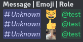
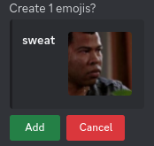
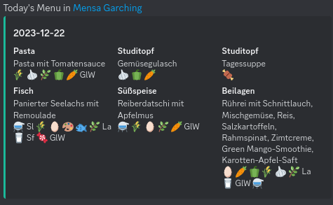
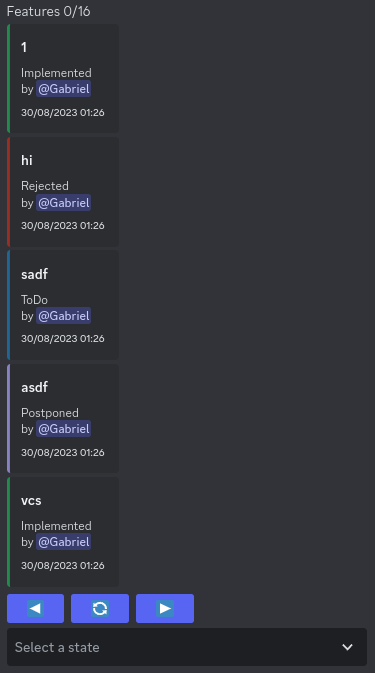
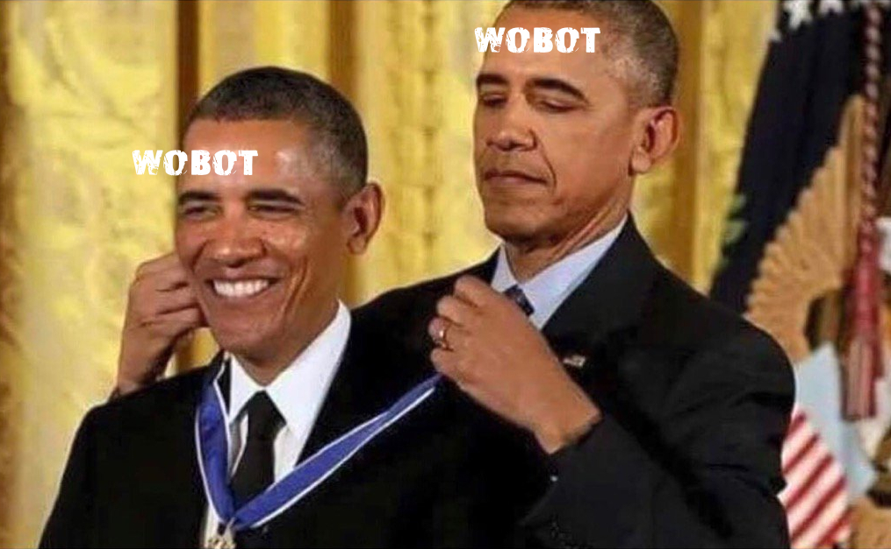
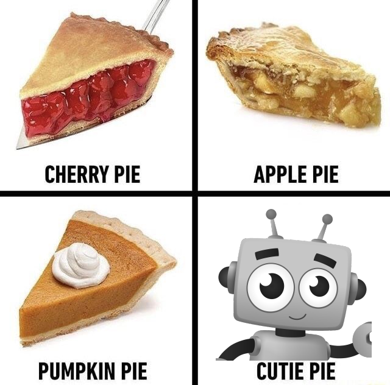

# WoBot

## Features

WoBot comes with a ton of features, including:

##### Improved Events:

create a Discord Event, a thread and allow RSVP via reactions with a **single** command  
export all events to your calendar (works on mobile)

##### Improved Emojis:

`add`, `rename` and `remove`  
`upload` to convert images into emojis  
`copy` emojis from other servers to your own

##### Easy Reaction roles

simply react with the emojis you want

##### MEMEs:

Meme generator, you can use any image from the internet  
Obama: when someone congratulates themselves  
Cutie Pie: tell your friends how cute they are

##### ToDo list

store anything you like

#### Mensa plan

know what's up for lunch  
show the next available plan  
automatically skips weekends

## Images

Not yet convinced? Have some images:








## Technical

WoBot is a Discord Bot written in [Rust](https://www.rust-lang.org/)
with [Poise](https://github.com/serenity-rs/poise/).
It's hosted on [Shuttle](https://www.shuttle.rs/) and requires a PostgresQL database.

The mensa plan uses the [Eat API](https://tum-dev.github.io/eat-api), the mensa coordinates link
to [Google Maps](https://www.google.com/maps).

Some features also require a font and images from the `assets` folder.
Due to legal reasons, not all of them can be provided here. What's missing:

- `Rockwill.ttf`: [Rockwill](https://fontmeme.com/fonts/rockwill-font/)
- `obama_medal.jpg`: [Obama Medal](https://a.pinatafarm.com/1015x627/ade80aa63d/obama-medal.jpg)
- `mensa_plan.png`: [Mensa Plan](https://www.meck-architekten.de/projekte/id/2019-mensa-campus-garching/)

### Configuration

`config.hjson` uses a human-friendly JSON version, [HJson](https://hjson.github.io/).

You can set up automatic reactions and replies based on keywords. All of them are case-insensitive.
Auto-reactions also support regex and match on word boundaries, ignoring punctuation around them.
The bot can react with both Unicode and custom Discord emojis, even animated ones.

#### Example Config

```hjson
{
  // channel for event threads
  event_channel_per_guild: {
    // guild_id: channel_id
    0: 0
  }
  auto_reactions: {
    robot: {
      name: "🤖"
    }
    vibing: {
      animated: true
      name: vibing
      // emoji id
      id: 0
    }
  }
  auto_replies: [
    {
      keywords: [
        "wobot info"
        "wobot help"
      ]
      // discord user id
      user: 0
      title: About WoBot
      description: "Hi, I'm **WoBot**, your friendly neighborhood bot. Please send any questions or feedback to my author, {user}. This message was sent {count} times. Have a nice day!"
      colour: 15844367
    }
}
```
